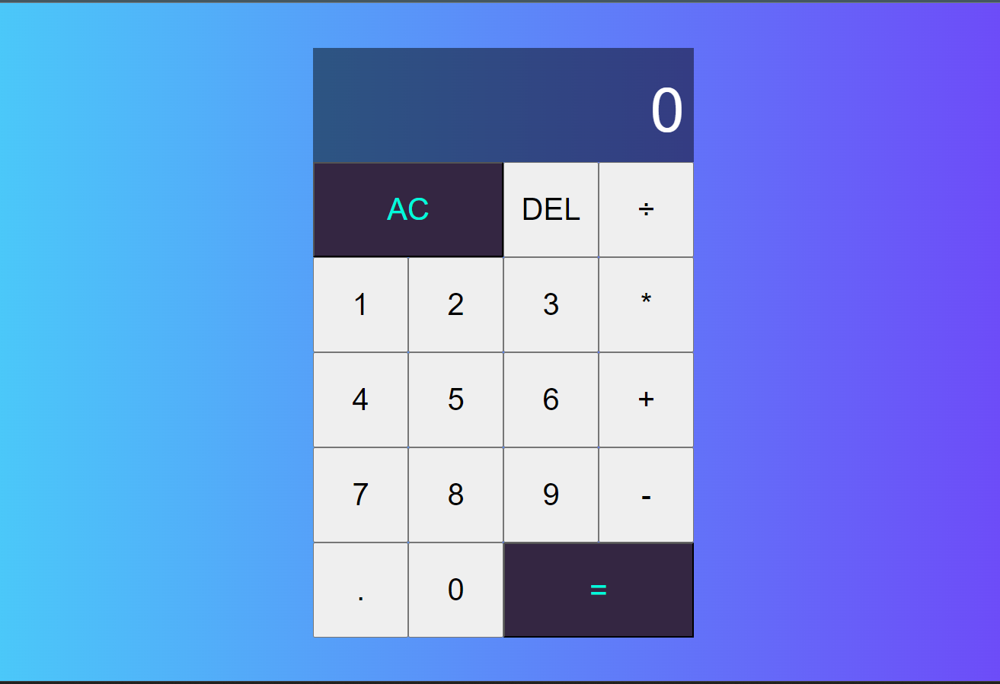

# Calculator

A simple calculator built using HTML, CSS, and JavaScript. It provides a responsive interface  and supports addition, subtraction, multiplication, and division.

## Preview



## Getting Started

These instructions will help you get a copy of the project up and running on your local machine for development and testing purposes.

### Prerequisites

- Web browser (Chrome, Firefox, Safari, etc.)

### Installation

1. Clone the repository:

   ```bash
   git clone https://github.com/your-username/calculator.git
   ```

2. Navigate to the project directory:

   ```bash
   cd calculator
   ```

3. Open the `index.html` file in your preferred web browser.

## Usage

1. Enter the numbers and operations using the provided buttons.

   - For click and use the number keys (`0-9`) and the following keys for operations:
     - `+` for addition
     - `-` for subtraction
     - `*` for multiplication
     - `/` for division
     - `Enter` or `=` for calculating the result
     - `Escape` or `C` for clearing the calculator

2. The result will be displayed in the calculator screen.

## Built With

- HTML - Structure and layout
- CSS - Styling
- JavaScript - Logic and calculations

## Contributing

Contributions are welcome! Please feel free to submit a pull request.

## Feedback

If you have any feedback, please [contact us](mailto:Hi.jainaman@gmail.com). We would love to hear from you!
